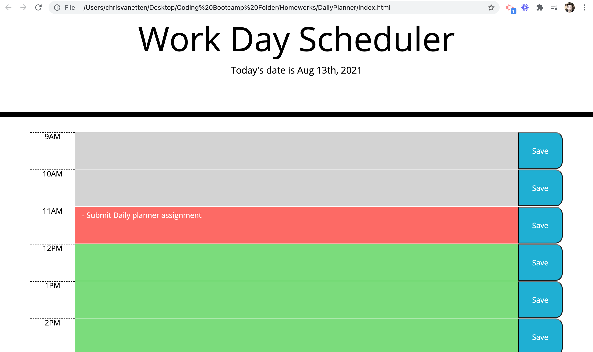

Welcome to your new Daily Planner app!

It can be difficult to keep track of all that tasks that need to be done in the course of the day, especially in the last year and a half, with so much of work becoming remote. Moreover, using sticky notes or pen and pad are old organizational ways of the past - with everything online, it's best to have an organizational tool that you can also access online.

Thankfully, here is a site that you can use for all your daily organizational needs. You can easily enter a task into a given time slot for an hour of the work day, and then save it to your planner with the click of a button. This task will remain saved even if you refresh the page! Furthermore, for your convenience, each time slot will be automatically color-coded based on whether it is currently in the past, the current hour, or in the future. That way, you can quickly know which tasks to prioritize from a simple glance.

Some features to come:
- Ways to organize multiple tasks within a single hour time slot
- Expansion of the daily planner into a collapsible, WEEKLY planner with multiple tabs for more preemptive organization

Screenshot of Daily Planner:

Links:
https://mistahv.github.io/DailyPlanner/ (application)
https://github.com/MistahV/DailyPlanner.git (git code)

Created by Christopher Van Etten